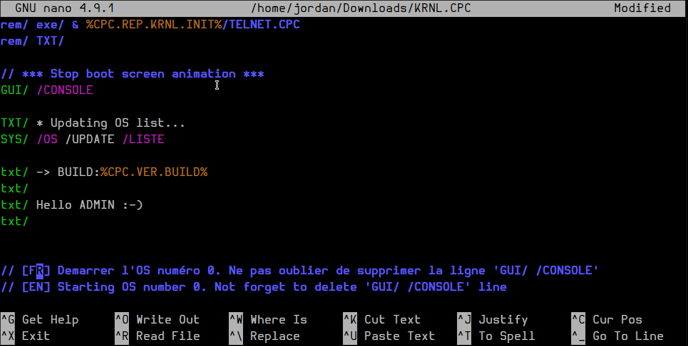

# Cpcdos' syntax for nano




## Installation

Clone the repository:
```bash
git clone https://github.com/SPinti-Software/nano-cpcdos
```

Create a `.nano` folder and copy the file `cpc.nanorc`:
```bash
mkdir ~/.nano/
cp ./nano-cpcdos/cpc.nanorc ~/.nano/
```

Add the syntax in your .nano file:
```bash
echo "include ~/.nano/cpc.nanorc" >> ~/.nanorc
```

Then enjoy !

### Website
Want to know more about CPCDOS ?
Check the [website](https://cpcdos.net) of the project

### Main Contributors

| Developer Name                                            | Description                                                  |
|-----------------------------------------------------------|--------------------------------------------------------------|
| [0v3rl0w](https://github.com/0v3rl0w)                     | Code and initial `README.md`                                 |
